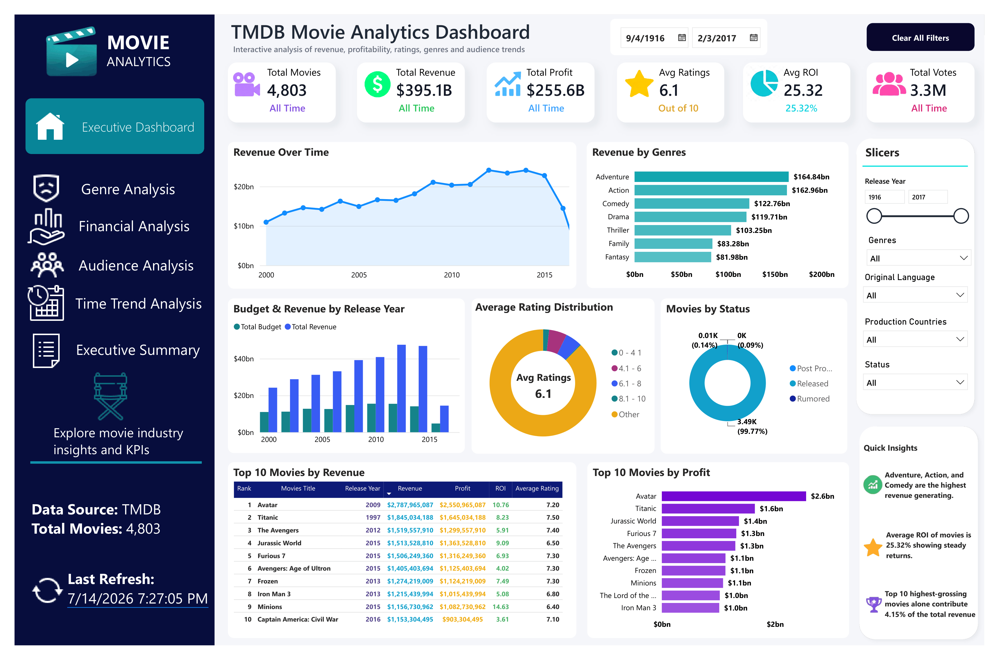

# 🎬 TMDB Movie Analytics Dashboard

<div align="center">


### 📊 End-to-End Business Intelligence Project using Python, Power BI, Power Query & DAX

</div>

---

# 📌 Executive Summary

The **TMDB Movie Analytics Dashboard** is an end-to-end Business Intelligence project that transforms raw movie data into meaningful business insights through data cleaning, feature engineering, exploratory data analysis, and interactive dashboard development.

The project demonstrates a complete Data Analytics workflow starting from raw CSV data using **Python (Pandas)** for preprocessing and feature engineering, followed by **Microsoft Power BI** for data modeling, DAX calculations, Power Query transformations, and interactive dashboard design.

The final solution enables stakeholders to analyze movie performance, profitability, audience engagement, ratings, genres, production trends, and financial performance through an executive-level dashboard.

This project was developed following industry-standard Business Intelligence practices and demonstrates practical skills required for Data Analyst and Business Intelligence roles.

---
# 📸 Dashboard Preview

The final Executive Dashboard provides an interactive view of movie industry performance.

Users can explore financial metrics, audience behavior, genre performance, and historical trends through dynamic visuals and filters.



---

# 🎯 Business Problem

The global movie industry invests billions of dollars in film production every year. However, only a small percentage of movies achieve exceptional commercial success.

Production companies, investors, and business stakeholders need reliable data-driven insights to answer questions such as:

- Which movies generate the highest revenue?
- Which genres consistently perform better?
- Does increasing the production budget increase revenue?
- Which movies produce the highest Return on Investment (ROI)?
- How do ratings and popularity influence financial success?
- Which production trends have changed over time?

Without proper analytics, answering these questions manually becomes difficult and time-consuming.

---

# 🎯 Project Objectives

The primary objective of this project is to develop a professional Business Intelligence solution that enables users to monitor and analyze movie performance from multiple business perspectives.

The project focuses on:

- Cleaning and preparing raw movie data
- Performing Feature Engineering
- Conducting Exploratory Data Analysis (EDA)
- Building an Executive Power BI Dashboard
- Creating interactive KPI Cards
- Performing Financial Analysis
- Analyzing Audience Engagement
- Understanding Genre Performance
- Tracking Historical Trends
- Generating Business Insights for decision-making

---

# 🏗️ Project Architecture

The project follows a complete Business Intelligence workflow.

```text
Raw Dataset
      │
      ▼
Python (Pandas)
Data Cleaning
      │
      ▼
Feature Engineering
      │
      ▼
Exploratory Data Analysis
      │
      ▼
Clean Dataset (CSV)
      │
      ▼
Power Query
      │
      ▼
Data Modeling
      │
      ▼
DAX Measures
      │
      ▼
Executive Dashboard
      │
      ▼
Business Insights
```

---

# 📂 Dataset Information

**Dataset Name**

TMDB 5000 Movies Dataset

**Source**

The Movie Database (TMDB)

The dataset contains comprehensive information about movies including financial, production, audience, and descriptive attributes.

### Dataset includes

- Movie ID
- Movie Title
- Original Title
- Budget
- Revenue
- Profit
- Return on Investment (ROI)
- Genres
- Popularity
- Average Rating
- Vote Count
- Runtime
- Release Date
- Production Companies
- Production Countries
- Spoken Languages
- Movie Status

### Engineered Features

Additional analytical features created during preprocessing include:

- Profit
- ROI
- Release Year
- Release Month
- Release Decade
- Clean Genres
- Clean Production Companies
- Clean Production Countries
- Clean Spoken Languages

### Dataset Size

| Metric | Value |
|---------|-------|
| Total Movies | **4,803** |
| Original Dataset | TMDB 5000 Movies |
| Processed Dataset | Cleaned & Feature Engineered |
| File Format | CSV |

---

# 🎯 Business Questions Answered

This dashboard answers several important business questions, including:

- Which movies generated the highest revenue?
- Which movies generated the highest profit?
- Which genres are most profitable?
- Which genres receive the highest audience ratings?
- Does budget influence revenue?
- Which years produced the highest revenue?
- How are movies distributed by status?
- Which movies generated exceptional ROI?
- How does popularity relate to financial success?
- What are the long-term production trends?

---
# 🛠 Technologies Used

This project integrates multiple technologies across the complete data analytics lifecycle.

| Category | Technologies |
|----------|--------------|
| Programming Language | Python 3.12 |
| Data Manipulation | Pandas, NumPy |
| Data Visualization | Matplotlib, Seaborn |
| Notebook Environment | Jupyter Notebook |
| Business Intelligence | Microsoft Power BI |
| Data Transformation | Power Query |
| Data Modeling | Star Schema |
| Calculations | DAX (Data Analysis Expressions) |
| Version Control | Git & GitHub |

---

# 📁 Project Structure

```
TMDB-Movie-Analytics/
│
├── dashboard/
│   ├── TMDB_Movie_Analytics.pbix
│   └── Dashboard.pdf
│
├── data/
│   ├── raw/
│   │   └── tmdb_5000_movies.csv
│   │
│   └── processed/
│       └── tmdb_movies_clean_powerbi.csv
│
├── images/
│   └── Dashboard.png
│
├── notebooks/
│   └── 01_TMDB_Movie_Analysis_EDA.ipynb
│
├── README.md
├── requirements.txt
└── .gitignore
```

---

# 🧹 Data Cleaning Process

The raw TMDB dataset required extensive preprocessing before analysis.

The following data cleaning steps were performed using **Python (Pandas)**:

### Data Inspection

- Dataset overview
- Data types analysis
- Missing value identification
- Duplicate record detection
- Statistical summary generation

### Data Cleaning

- Removed unnecessary columns
- Fixed inconsistent data types
- Cleaned JSON formatted columns
- Standardized categorical values
- Validated cleaned dataset
- Exported processed dataset for Power BI

The final cleaned dataset contains structured and analysis-ready information suitable for Business Intelligence reporting.

---

# ⚙️ Feature Engineering

To enhance analytical capabilities, several new business-focused features were created.

### Financial Features

- Profit
- Return on Investment (ROI)

### Time Features

- Release Year
- Release Month
- Release Decade

### Cleaned Text Features

- Genres
- Keywords
- Production Companies
- Production Countries
- Spoken Languages

These engineered features significantly improved dashboard interactivity and enabled deeper business analysis.

---

# 📊 Exploratory Data Analysis (EDA)

A comprehensive Exploratory Data Analysis was conducted to understand movie trends and identify meaningful business insights.

The analysis covered:

### Financial Analysis

- Budget Distribution
- Revenue Distribution
- Profit Distribution
- ROI Analysis

### Audience Analysis

- Average Ratings
- Vote Counts
- Popularity Distribution

### Genre Analysis

- Revenue by Genre
- Average Rating by Genre
- Profit by Genre

### Time Trend Analysis

- Movies Released Per Year
- Revenue Trends Over Time
- Production Growth by Decade

### Production Analysis

- Production Companies
- Production Countries
- Spoken Languages

---

# 📈 Statistical Analysis

Descriptive statistics were calculated to understand the overall characteristics of the dataset.

The analysis included:

- Mean
- Median
- Standard Deviation
- Minimum Values
- Maximum Values
- Quartiles

These statistics provided valuable insights into movie budgets, revenues, ratings, popularity, and profitability.

---

# 🔍 Correlation Analysis

Correlation analysis was performed to identify relationships between numerical variables.

The following attributes were analyzed:

- Budget
- Revenue
- Profit
- ROI
- Popularity
- Average Rating
- Vote Count

The analysis helped identify key drivers of movie success and financial performance.

---

# 📄 Processed Dataset

The cleaned dataset generated during preprocessing serves as the primary data source for the Power BI dashboard.

Output File:

```
data/processed/tmdb_movies_clean_powerbi.csv
```

The processed dataset includes:

- Cleaned data
- Engineered features
- Standardized categorical values
- Ready-to-use analytical structure
# 📊 Power BI Dashboard Development

After completing data cleaning and exploratory analysis, the processed dataset was imported into **Microsoft Power BI** to develop an interactive Executive Analytics Dashboard.

The dashboard was designed using Business Intelligence best practices to provide stakeholders with a clear overview of movie performance, financial metrics, audience behavior, and historical trends.

---

# 🔄 Power Query Transformations

Power Query was used to perform additional data preparation and ensure the dataset was optimized for reporting.

Transformations performed:

### Column Management

- Removed unnecessary columns
- Reordered columns for better readability
- Renamed columns where required

### Data Type Optimization

- Converted numerical columns into appropriate data types
- Formatted date fields
- Validated financial columns

### Data Cleaning

- Trimmed text values
- Cleaned categorical fields
- Removed inconsistencies
- Verified duplicate and missing values

### Dataset Preparation

The final Power BI dataset was structured and optimized for:

- Faster report performance
- Accurate calculations
- Reliable filtering
- Interactive analysis

---

# 🗂️ Data Modeling

A structured data model was created in Power BI following analytical modeling practices.

The dashboard uses a combination of:

- Fact Table
- Dimension Tables
- Reference Tables

## Main Fact Table

### Movies Table

Contains the main movie-level information:

- Movie ID
- Title
- Budget
- Revenue
- Profit
- ROI
- Rating
- Popularity
- Release Information

---

# Reference Tables

Additional reference tables were created to improve filtering and reporting performance.

## Genres Reference Table

Used for:

- Genre filtering
- Revenue analysis by genre
- Profit analysis by genre
- Rating comparison

## KPI Measures Table

A dedicated measures table was created to organize all DAX calculations.

Benefits:

- Cleaner data model
- Easier measure management
- Professional Power BI development practice

---

# 🔗 Data Relationships

Relationships were created between tables to enable accurate filtering and cross-analysis.

Example:

```
Movies
   |
   | 1 : Many
   |
Movies_Genres
   |
   |
Genres
```

The relationship design allows users to filter movies by genre while maintaining accurate financial calculations.

---

# 🧮 DAX Measures Development

DAX (Data Analysis Expressions) was used to create dynamic calculations for the dashboard.

Key measures include:

### Total Movies

Calculates the total number of movies available.

### Total Revenue

Calculates total revenue generated by all movies.

### Total Profit

Calculates overall movie profitability.

### Average Rating

Calculates average audience rating.

### Average ROI

Measures return on investment performance.

### Total Votes

Tracks audience engagement through vote counts.

These measures allow the dashboard to dynamically respond to filters and user interactions.

---

# 📌 KPI Dashboard Metrics

The Executive Dashboard contains high-level KPI cards for quick business monitoring.

KPIs include:

| KPI | Purpose |
|------|---------|
| Total Movies | Total number of movies analyzed |
| Total Revenue | Overall revenue performance |
| Total Profit | Financial profitability |
| Average Rating | Audience satisfaction level |
| Average ROI | Investment efficiency |
| Total Votes | Audience engagement |

These KPIs provide stakeholders with an immediate understanding of overall movie industry performance.

---

# 🎨 Dashboard Design Approach

The dashboard was designed with a focus on:

- Clean professional layout
- Business-focused storytelling
- Easy navigation
- Consistent visual hierarchy
- Interactive user experience

Design elements include:

- Executive-style KPI cards
- Custom sidebar navigation
- Professional icons
- Interactive slicers
- Clear visual hierarchy

The goal was to transform complex movie data into simple, actionable insights.
# 📊 Executive Dashboard Overview

The final Power BI solution provides an interactive Executive Dashboard designed to analyze movie industry performance from financial, audience, genre, and historical perspectives.

The dashboard combines multiple analytical views into a single reporting solution, allowing users to explore movie performance through dynamic filters and interactive visuals.

---

# 🎯 Dashboard Features

The dashboard includes:

- Executive KPI Cards
- Interactive Filters
- Revenue Analysis
- Genre Performance Analysis
- Financial Comparison
- Audience Engagement Analysis
- Movie Performance Ranking
- Historical Trend Analysis
- Quick Business Insights

---

# 📌 Key Dashboard Components

## 1. KPI Cards

The top section of the dashboard provides a high-level overview of movie performance.

### KPI Metrics:

### 🎬 Total Movies

Displays the total number of movies available in the dataset.

---

### 💰 Total Revenue

Shows the combined revenue generated by all movies.

---

### 📈 Total Profit

Measures the overall profitability generated from movie releases.

---

### ⭐ Average Rating

Displays the average audience rating across all movies.

---

### 🔄 Average ROI

Shows the average return generated compared with movie investment.

---

# 📈 Revenue Analysis

## Revenue Over Time

This visualization analyzes how movie revenue has changed across different years.

Business questions answered:

- How has movie revenue evolved historically?
- Which periods generated higher revenue?
- Are movies becoming more commercially successful over time?

---

# 🎭 Revenue by Genres

This analysis compares financial performance across movie genres.

Insights generated:

- Which genres contribute the highest revenue?
- Which categories attract larger audiences?
- Which genres have stronger commercial performance?

---

# 💵 Budget vs Revenue Analysis

This visualization compares movie investment with financial returns.

Business questions answered:

- Does higher production budget result in higher revenue?
- Which movies achieved strong returns despite lower budgets?
- Which investments generated poor financial outcomes?

---

# ⭐ Audience Rating Analysis

The rating distribution visualization analyzes audience satisfaction.

It helps understand:

- Overall rating patterns
- Audience preferences
- Movie quality distribution

---

# 🎬 Movie Status Analysis

This visual analyzes movies based on their release status.

It provides insight into:

- Released movies
- Production trends
- Industry activity

---

# 🏆 Top 10 Movies Analysis

## Top 10 Movies by Revenue

Identifies the highest-grossing movies based on total revenue.

Used for:

- Performance benchmarking
- Understanding blockbuster characteristics
- Financial comparison

---

## Top 10 Movies by Profit

Highlights movies that generated the highest profitability.

Used for:

- Investment analysis
- ROI understanding
- Identifying successful business strategies

---

# 🎛️ Interactive Dashboard Controls

The dashboard provides interactive filtering capabilities.

Users can analyze data using:

- Release Year
- Genre
- Movie Status
- Date Filters

Interactive filtering enables users to perform detailed exploration without modifying the report.

---

# 💡 Key Business Insights

The analysis generated several important findings:

### Revenue Drivers

- Movies with larger production budgets generally have higher revenue potential.
- A small number of blockbuster movies contribute significantly to total industry revenue.

### Genre Performance

- Adventure and Action genres demonstrate strong commercial performance.
- Genre selection plays an important role in revenue generation.

### Audience Behavior

- Popularity and vote count provide strong indicators of audience engagement.
- Ratings help identify audience satisfaction trends.

### Investment Performance

- High investment does not always guarantee profitability.
- Some low-budget movies achieved exceptional ROI.

### Industry Trends

- Movie production activity has increased significantly over time.
- Modern decades show higher production volume and financial activity.

---

# 📌 Business Recommendations

Based on the analysis, production companies can consider:

### 1. Data-Driven Investment Decisions

Use historical performance data to evaluate potential movie investments.

---

### 2. Genre Strategy Optimization

Focus marketing and production efforts on genres with strong audience demand and financial performance.

---

### 3. Budget Planning

Balance production costs with expected revenue potential instead of relying only on large budgets.

---

### 4. Audience Engagement Strategy

Use popularity, ratings, and voting patterns to understand audience preferences.

---

### 5. ROI-Focused Decisions

Prioritize projects with strong profitability potential rather than only focusing on revenue.

---

# ▶️ How to Run This Project

## 1. Clone Repository

Clone this repository using:

```bash
git clone https://github.com/apex-analytics-solutions/TMDB-Movie-Analytics.git
```

Navigate into the project folder:

```bash
cd TMDB-Movie-Analytics
```

---

# 🐍 Running Python Analysis

## 2. Install Required Libraries

Install project dependencies:

```bash
pip install -r requirements.txt
```

---

## 3. Open Jupyter Notebook

Launch Jupyter Notebook:

```bash
jupyter notebook
```

Open:

```
notebooks/01_TMDB_Movie_Analysis_EDA.ipynb
```

Run the notebook to reproduce:

- Data exploration
- Data cleaning
- Feature engineering
- Exploratory Data Analysis

---

# 📊 Opening Power BI Dashboard

The completed Power BI dashboard is available here:

```
dashboard/TMDB_Movie_Analytics.pbix
```

Open the file using:

**Microsoft Power BI Desktop**

The dashboard includes:

- KPI Cards
- Interactive slicers
- Revenue analysis
- Genre analysis
- Profit analysis
- Audience analysis
- Business insights

---

# 📦 Project Deliverables

This repository contains:

| Component | Description |
|-----------|-------------|
| Python Notebook | Complete EDA workflow |
| Raw Dataset | Original TMDB dataset |
| Processed Dataset | Cleaned analytical dataset |
| Power BI Dashboard | Interactive Executive Dashboard |
| Dashboard PDF | Exported dashboard report |
| Documentation | Complete project explanation |

---

# 🚀 Future Improvements

Future enhancements planned for this project:

## Power BI Deployment

- Publish dashboard to Power BI Service
- Create live interactive dashboard link
- Enable online dashboard sharing

---

## Advanced Analytics

Potential improvements:

- Machine Learning model for revenue prediction
- Movie success prediction model
- Audience segmentation analysis
- Recommendation system

---

## Data Engineering Improvements

Future pipeline enhancements:

- Automated data refresh
- API-based data collection
- Cloud data warehouse integration

---

# 🧠 Skills Demonstrated

This project demonstrates practical experience in:

### Data Analysis

- Data Cleaning
- Exploratory Data Analysis
- Statistical Analysis
- Business Insight Generation

### Python

- Pandas
- NumPy
- Matplotlib
- Seaborn
- Jupyter Notebook

### Power BI

- Dashboard Development
- Data Modeling
- Power Query
- DAX Measures
- KPI Design
- Interactive Reporting

### Business Intelligence

- Data Storytelling
- Decision Support
- Performance Analysis
- Executive Reporting

---

# 📌 Project Status

Current Status:

✅ Data Collection Completed

✅ Data Cleaning Completed

✅ Feature Engineering Completed

✅ Exploratory Data Analysis Completed

✅ Power BI Dashboard Completed

✅ Business Insights Generated

⬜ Power BI Online Deployment

⬜ Advanced Predictive Analytics

---

# 👨‍💻 Author

## Anees Rehman

Aspiring Data Analyst | Business Intelligence Developer

### Technical Skills

- Python
- SQL
- Power BI
- Excel
- Pandas
- Data Visualization
- Business Analytics

---

# 🤝 Connect With Me

GitHub:

https://github.com/apex-analytics-solutions

---

# ⭐ Support

If you found this project useful or informative, consider giving this repository a ⭐.

Your feedback and suggestions are welcome.